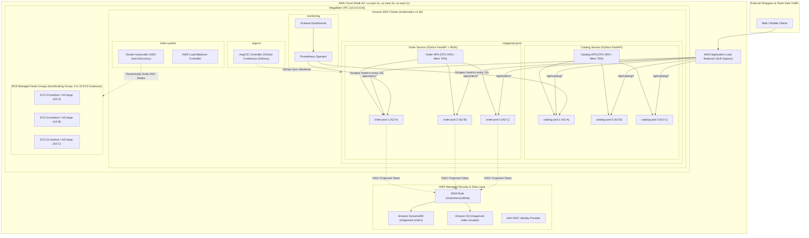

# MegaMart E-Commerce Migration & Modernization (ShopCore)

> **Enterprise Cloud-Native Architecture on Amazon EKS with GitOps, IRSA, and Dual-Tier Autoscaling**

---

## 1. Executive Summary & Scenario

**MegaMart** is a rapidly scaling online retail enterprise whose primary revenue engine was a monolithic legacy application known as **ShopCore**. ShopCore previously operated on legacy virtual machines and suffered from severe bottlenecks:
- **Flash Sale Degradation**: Traffic surges during high-velocity promotions overwhelmed the monolith, crashing both product discovery and payment processing simultaneously.
- **Slow Release Velocity**: Deployments required full monolith rebuilds, scheduled downtime, and manual server patching.
- **Security & IAM Risks**: AWS credentials and database connection strings were statically embedded in configuration files.
- **Cost Inefficiency**: Compute infrastructure was statically over-provisioned 24/7 to accommodate occasional traffic spikes.

### The Modernization Strategy
This repository decomposes ShopCore into microservices, containerizes workloads with non-root security contexts, automates zero-touch continuous delivery via **ArgoCD (GitOps)**, and deploys on a Multi-AZ **Amazon EKS** cluster adhering to the **AWS Well-Architected Framework**.



---

## 2. AWS Well-Architected Framework Alignment

| Well-Architected Pillar | MegaMart Architecture Implementation |
| :--- | :--- |
| **Operational Excellence** | **GitOps via ArgoCD** with root App-of-Apps pattern. No manual `kubectl apply` in production. Infrastructure as Code via Terraform. Standardized JSON logging, health probes (`/healthz`, `/readyz`), and Prometheus metrics scraping. |
| **Security** | **IAM Roles for Service Accounts (IRSA)** eliminates static AWS credentials. Worker nodes in private subnets across 3 AZs. Non-root container security context (`appuser:10001`), read-only root filesystems, and Kubernetes NetworkPolicies for zero-trust traffic isolation. |
| **Reliability** | **Multi-AZ redundancy** across 3 Availability Zones. Dual-tier autoscaling with **Horizontal Pod Autoscaler (HPA)** for rapid pod scale-out and **Cluster Autoscaler** for dynamic EC2 node expansion. Topology spread constraints and Pod Disruption Budgets (`minAvailable: 50%`). |
| **Performance Efficiency** | Multi-stage Python 3.11 container builds. Async I/O powered by FastAPI and Uvicorn. Precise CPU/memory requests and limits. Load testing validated up to 600+ virtual users with sub-500ms P95 latency. |
| **Cost Optimization** | Shared AWS ALB Ingress with path-based routing (`/api/catalog`, `/api/orders`), preventing multi-ALB proliferation. Right-sized container requests (`requests.cpu: 100m`). Cluster Autoscaler aggressive scale-down rules (`--scale-down-unneeded-time=10m`). |

---

## 3. Repository Structure

```
megamart-ecommerce-modernization/
├── apps/
│   ├── catalog-service/             # Catalog & Search Microservice (Python FastAPI)
│   │   ├── main.py                  # API endpoints, telemetry middleware, probes
│   │   ├── models.py                # Pydantic data schemas
│   │   ├── data/products.json       # Mock catalog inventory dataset
│   │   ├── requirements.txt         # FastAPI, Uvicorn, Prometheus-Client, Pytest
│   │   ├── test_catalog.py          # Pytest automated test suite
│   │   ├── Dockerfile               # Multi-stage non-root container build
│   │   └── .dockerignore
│   └── order-service/               # Order & Checkout Microservice (Python FastAPI)
│       ├── main.py                  # Checkout logic, DynamoDB/S3 IRSA client, metrics
│       ├── models.py                # Pydantic Order, Item, Address models
│       ├── requirements.txt         # FastAPI, Boto3, Prometheus-Client, Pytest
│       ├── test_order.py            # Pytest test suite for checkout & persistence
│       ├── Dockerfile               # Multi-stage non-root container build
│       └── .dockerignore
├── terraform/                       # Infrastructure as Code (Terraform)
│   ├── main.tf                      # AWS provider and state configuration
│   ├── variables.tf                 # Cluster and network parameters
│   ├── outputs.tf                   # EKS endpoints, ARNs, and table names
│   ├── vpc.tf                       # Multi-AZ VPC (3 Public, 3 Private subnets, 3 NAT GWs)
│   ├── eks.tf                       # EKS Cluster v1.30, Managed Node Groups with ASG tags
│   ├── iam-irsa.tf                  # OIDC Provider, IRSA IAM roles for Order, CA, ALB
│   ├── dynamodb-s3.tf               # DynamoDB orders table & encrypted S3 receipts bucket
│   └── terraform.tfvars.example     # Environment variables template
├── gitops/                          # Declarative GitOps Manifests (ArgoCD & Kustomize)
│   ├── argocd/
│   │   ├── root-application.yaml    # Root App-of-Apps master manifest
│   │   └── applications.yaml        # Child ArgoCD applications for all services
│   ├── base/
│   │   ├── catalog-service/         # Deployment, Service, HPA, PDB, Kustomization
│   │   ├── order-service/           # Deployment, Service, IRSA ServiceAccount, HPA, PDB
│   │   ├── ingress/                 # AWS Load Balancer Controller Ingress routing
│   │   ├── cluster-autoscaler/      # Cluster Autoscaler deployment, RBAC, IRSA SA
│   │   └── network-policies/        # Zero-trust default-deny and ingress policies
│   └── environments/
│       ├── staging/                 # Staging overlay (scaled down, debug logging)
│       └── production/              # Production overlay (HA replicas, strict limits)
├── monitoring/                      # Observability Stack
│   ├── prometheus-servicemonitors.yaml # Prometheus Operator ServiceMonitors
│   ├── prometheus-rules.yaml        # Alerting rules (Latency, 5xx rate, HPA saturation)
│   └── dashboards/
│       └── megamart-overview-dashboard.json # Grafana Flash-Sale Dashboard model
├── load-testing/                    # Flash-Sale Traffic Simulation
│   ├── flash-sale-loadtest.js       # k6 ramp-up script (10 -> 600 VUs)
│   ├── locustfile.py                # Python Locust realistic user flow
│   └── run-load-test.sh             # Test execution script
└── README.md                        # Production Runbook & Documentation
```

---

## 4. Microservices Decomposition

### 4.1 Catalog-Service (`apps/catalog-service`)
- **Purpose**: Handles product discovery, category filtering, keyword search, and bulk inventory checks.
- **Tech Stack**: Python 3.11, FastAPI, Uvicorn, Pydantic, Prometheus-Client.
- **Key Endpoints**:
  - `GET /api/catalog/products`: Paginated product listing with category filtering.
  - `GET /api/catalog/products/{id}`: Single product detail lookups.
  - `GET /api/catalog/search?q={term}`: Case-insensitive search across title, description, and tags.
  - `POST /api/catalog/inventory/check`: Bulk inventory verification called by order workflows.
  - `GET /healthz`, `GET /readyz`: Kubernetes liveness and readiness probes.
  - `GET /metrics`: Prometheus telemetry endpoint.

### 4.2 Order-Service (`apps/order-service`)
- **Purpose**: Processes customer checkouts, calculates order totals, persists order records to **Amazon DynamoDB**, and writes receipts to **Amazon S3**.
- **Security Model (IRSA)**: Boto3 automatically assumes the IAM role via the projected service account token (`AWS_ROLE_ARN` and `AWS_WEB_IDENTITY_TOKEN_FILE`).
- **Key Endpoints**:
  - `POST /api/orders/checkout`: Accepts cart items, writes to DynamoDB (`megamart-orders`), uploads receipt JSON to S3 (`megamart-order-receipts`), and records metrics.
  - `GET /api/orders/{order_id}`: Retrieves order status and item summary.
  - `GET /api/orders/user/{user_id}`: Lists historical orders for a user.
  - `GET /healthz`, `GET /readyz`, `GET /metrics`.

---

## 5. Step-by-Step Production Runbook

### Step 1: Provision Cloud Infrastructure with Terraform

1. Navigate to the `terraform/` directory:
   ```bash
   cd terraform
   cp terraform.tfvars.example terraform.tfvars
   ```
2. Initialize and review the Terraform plan:
   ```bash
   terraform init
   terraform plan -out=tfplan
   ```
3. Apply the infrastructure:
   ```bash
   terraform apply tfplan
   ```
4. Configure local `kubectl` context to connect to your new EKS cluster:
   ```bash
   aws eks update-kubeconfig --region us-east-1 --name megamart-eks-cluster
   kubectl get nodes -o wide
   ```

---

### Step 2: Build & Push Container Images to Amazon ECR

1. Authenticate Docker with Amazon ECR:
   ```bash
   AWS_ACCOUNT_ID=$(aws sts get-caller-identity --query Account --output text)
   AWS_REGION="us-east-1"
   aws ecr get-login-password --region ${AWS_REGION} | docker login --username AWS --password-stdin ${AWS_ACCOUNT_ID}.dkr.ecr.${AWS_REGION}.amazonaws.com
   ```
2. Create ECR repositories (if not already created):
   ```bash
   aws ecr create-repository --repository-name megamart/catalog-service || true
   aws ecr create-repository --repository-name megamart/order-service || true
   ```
3. Build and push `catalog-service`:
   ```bash
   cd apps/catalog-service
   docker build -t ${AWS_ACCOUNT_ID}.dkr.ecr.${AWS_REGION}.amazonaws.com/megamart/catalog-service:v1.0.0 .
   docker push ${AWS_ACCOUNT_ID}.dkr.ecr.${AWS_REGION}.amazonaws.com/megamart/catalog-service:v1.0.0
   cd ../..
   ```
4. Build and push `order-service`:
   ```bash
   cd apps/order-service
   docker build -t ${AWS_ACCOUNT_ID}.dkr.ecr.${AWS_REGION}.amazonaws.com/megamart/order-service:v1.0.0 .
   docker push ${AWS_ACCOUNT_ID}.dkr.ecr.${AWS_REGION}.amazonaws.com/megamart/order-service:v1.0.0
   cd ../..
   ```

---

### Step 3: Install ArgoCD & Deploy via GitOps (App-of-Apps)

1. Install ArgoCD onto the EKS cluster:
   ```bash
   kubectl create namespace argocd
   kubectl apply -n argocd -f https://raw.githubusercontent.com/argoproj/argo-cd/stable/manifests/install.yaml
   ```
2. Wait for ArgoCD server to be ready:
   ```bash
   kubectl wait --for=condition=available deployment/argocd-server -n argocd --timeout=300s
   ```
3. Apply the Root Application manifest:
   ```bash
   kubectl apply -f gitops/argocd/root-application.yaml
   ```
4. Verify that ArgoCD synchronizes all child applications (`catalog-service`, `order-service`, `ingress`, `cluster-autoscaler`):
   ```bash
   kubectl get applications -n argocd
   kubectl get pods -n megamart-prod
   ```

---

### Step 4: Verify IAM Roles for Service Accounts (IRSA)

1. Verify the ServiceAccount has the IAM role ARN annotation:
   ```bash
   kubectl get sa order-service-sa -n megamart-prod -o yaml
   ```
2. Exec into an `order-service` pod and verify projected token volume and AWS identity:
   ```bash
   POD_NAME=$(kubectl get pods -n megamart-prod -l app.kubernetes.io/name=order-service -o jsonpath='{.items[0].metadata.name}')
   kubectl exec -it ${POD_NAME} -n megamart-prod -- env | grep AWS
   ```
   *Expected Output:*
   ```text
   AWS_ROLE_ARN=arn:aws:iam::123456789012:role/megamart-order-service-irsa-role
   AWS_WEB_IDENTITY_TOKEN_FILE=/var/run/secrets/eks.amazonaws.com/serviceaccount/token
   ```

---

### Step 5: Setup AWS Load Balancer Controller & ALB Ingress

1. Install AWS Load Balancer Controller via Helm:
   ```bash
   helm repo add eks https://aws.github.io/eks-charts
   helm repo update
   helm install aws-load-balancer-controller eks/aws-load-balancer-controller \
     -n kube-system \
     --set clusterName=megamart-eks-cluster \
     --set serviceAccount.create=true \
     --set serviceAccount.name=aws-load-balancer-controller \
     --set serviceAccount.annotations."eks\.amazonaws\.com/role-arn"=$(terraform -chdir=terraform output -raw aws_load_balancer_controller_irsa_role_arn)
   ```
2. Retrieve the provisioned ALB endpoint:
   ```bash
   kubectl get ingress megamart-ingress -n megamart-prod
   ```
   Save the `ADDRESS` (e.g. `k8s-megamart-xxx.us-east-1.elb.amazonaws.com`).

---

### Step 6: Setup Observability (Prometheus & Grafana)

1. Deploy kube-prometheus-stack:
   ```bash
   helm repo add prometheus-community https://prometheus-community.github.io/helm-charts
   helm repo update
   helm install prometheus-stack prometheus-community/kube-prometheus-stack \
     -n monitoring --create-namespace
   ```
2. Apply MegaMart ServiceMonitors and Alerting Rules:
   ```bash
   kubectl apply -f monitoring/prometheus-servicemonitors.yaml
   kubectl apply -f monitoring/prometheus-rules.yaml
   ```
3. Import the Grafana Dashboard:
   - Port-forward Grafana:
     ```bash
     kubectl port-forward svc/prometheus-stack-grafana 3000:80 -n monitoring
     ```
   - Open `http://localhost:3000` (User: `admin`, Password from `kubectl get secret -n monitoring prometheus-stack-grafana -o jsonpath="{.data.admin-password}" | base64 --decode`).
   - Navigate to **Dashboards -> Import** and upload [`monitoring/dashboards/megamart-overview-dashboard.json`](monitoring/dashboards/megamart-overview-dashboard.json).

---

### Step 7: Simulate Flash-Sale Traffic to Test Autoscaling

1. Open three terminal windows:
   - **Terminal 1 (Pod Scaling)**:
     ```bash
     kubectl get hpa -n megamart-prod -w
     ```
   - **Terminal 2 (Node Scaling)**:
     ```bash
     kubectl get nodes -w
     ```
   - **Terminal 3 (Load Runner)**:
     ```bash
     cd load-testing
     ALB_URL="http://$(kubectl get ingress megamart-ingress -n megamart-prod -o jsonpath='{.status.loadBalancer.ingress[0].hostname}')"
     ./run-load-test.sh "${ALB_URL}"
     ```

2. **Expected Autoscaling Behavior**:
   - **T+60s**: Virtual users ramp up to 400. CPU utilization on `catalog-service` and `order-service` exceeds 60%.
   - **T+90s**: HPA triggers pod scale-out from 3 replicas to 12-15 replicas.
   - **T+120s**: Node capacity is exhausted; new pods enter `Pending` state.
   - **T+150s**: Cluster Autoscaler detects unschedulable pods, modifies the AWS AutoScaling Group, and provisions additional EC2 worker nodes (scaling from 3 nodes up to 5-7 nodes).
   - **T+360s**: Load test ends; HPA scales pods down after stabilization window; Cluster Autoscaler scales down idle nodes after 10 minutes.

---

### Step 8: Running Automated Unit Tests

Run automated unit test suites for both microservices locally:

```bash
# Test Catalog Service
cd apps/catalog-service
python -m pytest test_catalog.py -v

# Test Order Service
cd ../order-service
python -m pytest test_order.py -v
```

---

### Step 9: Teardown & Clean Up

To avoid ongoing AWS infrastructure charges:
```bash
# 1. Delete Ingress (frees ALB)
kubectl delete ingress megamart-ingress -n megamart-prod

# 2. Delete ArgoCD Applications
kubectl delete -f gitops/argocd/root-application.yaml

# 3. Destroy Terraform Resources
cd terraform
terraform destroy -auto-approve
```

---

## 6. Summary of Architectural Achievements

1. **Monolith Decomposed**: ShopCore is modularized into independently scalable Python microservices (`catalog-service` and `order-service`).
2. **Zero Hardcoded Secrets**: Complete IRSA integration with AWS IAM OIDC token projection for DynamoDB and S3 operations.
3. **Automated Continuous Delivery**: 100% declarative GitOps pipeline managed via ArgoCD.
4. **Flash-Sale Resilience**: Dual-tier autoscaling (HPA pod scaling + Cluster Autoscaler EC2 node scaling) across 3 Availability Zones.
5. **Real-time Observability**: End-to-end metrics scraping via Prometheus ServiceMonitors and real-time business/infrastructure visualization on Grafana.
